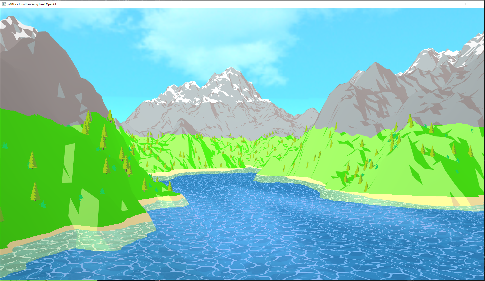
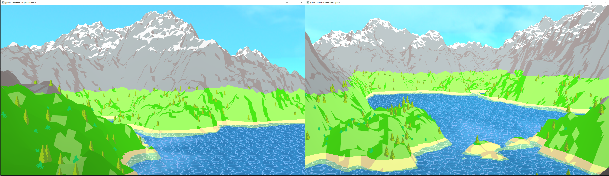
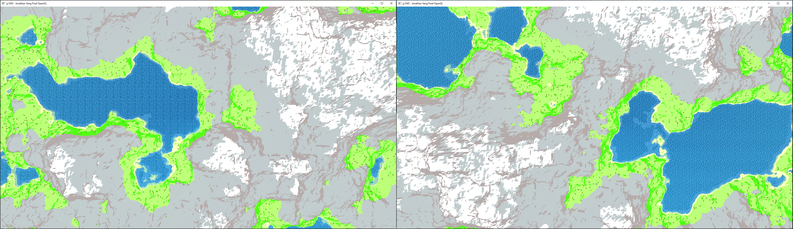
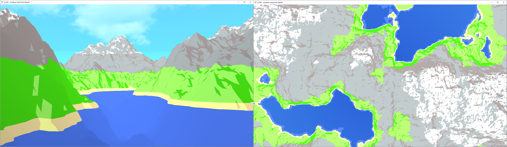
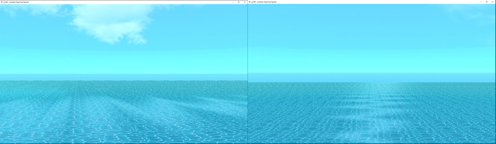
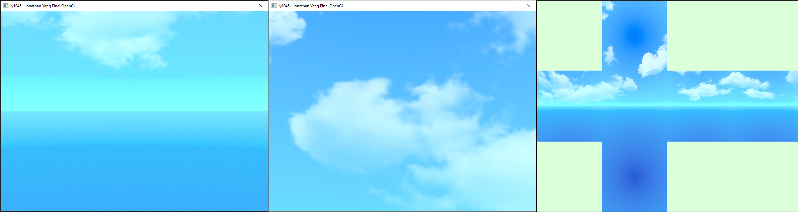
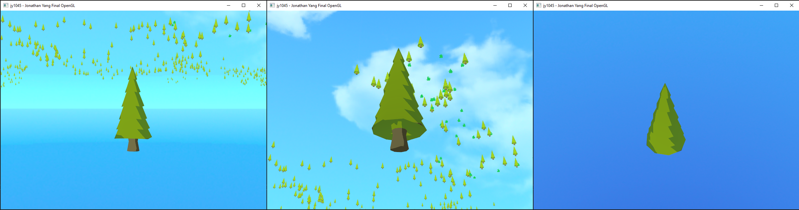
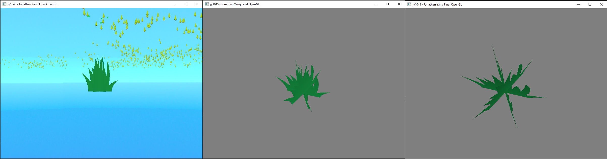

# Low-Poly Toon Procedural Terrain
assignment-5-final-project-individual-jyang created by GitHub Classroom
- Jonathan Yang
- NYU ID: jy1045

## Overview
 

## Controls

There's 2 sets of controls, the first one controls the camera with first person view, while the second is for the top down view of the island:
- <b>Keys 1, 2, 3, and 0:</b> 1-3 jumps to specific camera views I've chosen. 0 jumps to a Tree and Grass model for presenting/debugging.

 
1st Person Camera (Initial camera configuration and can be chosen by clicking Keys 1-3):
- <b>WASD:</b> The W and S keys moves the camera forwards or backwards. The A and D keys strafes the camera left or right.
- <b>Up, Down, Left, Right:</b> Rotates the camera in the arrow direction.
- <b>Space:</b> Moves the camera upwards.
- <b>LEFT CTRL:</b> Moves the camera downwards.

 
Top-Down Camera (Can be chosen by clicking TAB):
- <b>WASD:</b> These keys moves the camera UP, DOWN, LEFT, or RIGHT accordingly.
- <b>Up, Down:</b> Zooms in or out from the Top-Down view of the island.
- <b>Space:</b> Jumps to target x and z coordinate location and back to 1st Person camera view.

## Files

<b>src files:</b> Helpers.cpp, Helpers.h, main.cpp, Perlin.h, Skybox.h, Sphere.h, Terrain.h, Water.h

<b>shader files:</b> billboard-fragment.glsl, billboard-vertex.glsl, fragment.glsl, skybox-fragment.glsl, skybox-vertex.glsl, terrain-fragment.glsl, terrain-vertex.glsl, vertex.glsl, water-fragment.glsl, water-vertex.glsl

<b>data files:</b> skybox/back.ppm and png, skybox/bottom.ppm and png, skybox/front.ppm and png, skybox/left.ppm and png, skybox/right.ppm and png, skybox/top.ppm and png, billboard.ppm, tree.off, water.ppm

### Compilation instructions
<i> Will not work due to this being the public version and does not contain the libraries provided by the class</i>
```bash
git clone --recursive https://github.com/nyu-cs-gy-6533-fall-2022/assignment-5-final-project-individual-jyang.git
cd assignment-5-final-project-individual-jyang
mkdir build
cd build
cmake ../ # re-run cmake when you add/delete source files
```
- Set .sln as startup project and run on Visual Studio

## Results
### (1) Procedural Terrain Generated via Perlin Noise
Perlin noise is used to procedurally generate the terrain quads, with each vertex height being set up by inputted Perlin configurations, where we can change the amplitude, frequency, octaves, and persistence as needed. For example, the higher persistence gives the terrain more roughness, creating a low poly look when simple two color shading is applied on the Sand, Grass, and Mountains. Each terrain is decided by height, where the cutoff between the water/sand and sand/grass is determined by a specific height plus a sin wave based on the coordinates. The cutoff between the grass and mountains are also determined by Perlin noise for a more zig-zagged transition. The snow on top of the mountain is determined by the slope after a specific height, where the quads are the normal rock coler if steeper, and the snow color if flatter. Finally, a darker or lighter color is chosen based by intensity from the light direction and the terrain quad normal with depth from the camera added to differentiate between far/close terrain.
 

### (2) Water Ripples and Animation
The water plane is created by repeating a water.ppm file texture across repeating quads. The up and down waves are generated in the vertex shader using sin waves to determine each vertex height position based on time. The same sin waves are used to generate waves between textures and the wave normals are calculated based on the angle of the quad. In the fragment shader, phong shading is applied to the water for lighting using the updated normals, the water texture is animated in circles with distortion based on time, and the transparency is enabled to 0.5 with GL_BLEND.
 

### (3) Skybox
The skybox is a cubemap with 6 faces with a texture for each face. Folding the image shown in the last picture below gives us a top, left, right, back, and bottom cube images to create the background sky and water to generate the scene. These 6 pictures for the cube are read as png files using the stb_image.h image loading library (initially used ppm files, but the sky color ppm images would alter due to some weird glitch between Git and CMYK values). This cubemap is drawn as the first object and depth mask is disabled so it'll stay in the background. Additionally the skybox view matrix is centered around the camera depending on where the user moves, so it rotates/scales/translates to give the illusion of a large scenic background.
 

### (4) OFF Model Trees
An OFF Model is read and populated based on heights from each vertex of the procedural terrain. For each vertex of the terrain, a random number generator is used to determine whether or not to draw the OFF model tree or not at that point. Additionally, the tree color for the leaves or trunk is determined based on height plus the y coordinate of the terrain. Lastly, the same effect of a darker or lighter color is chosen based on intensity from the light direction and normal with depth from the camera added to differentiate between far/close trees.
 

### (5) Grass Billboards
Similar to the OFF model trees, the grass billboards are also populated based on heights from each vertex of the procedural terrain using random numbers on each coordinate. Depth from the camera is also added to differentiate between far/close grass billboards. Unlike OFF models though, the grass is generated by a simple quad with a grass.ppm texture applied on it, and rotated twice from the center. This effect can be seen below allows us to create grass while reducing the number of faces to draw. The grass is rotated randomly to randomize the appearance per grass bush. The grass is also rendered based on distance, so if the camera pans away far, the grass billboards will not be drawn.
 
